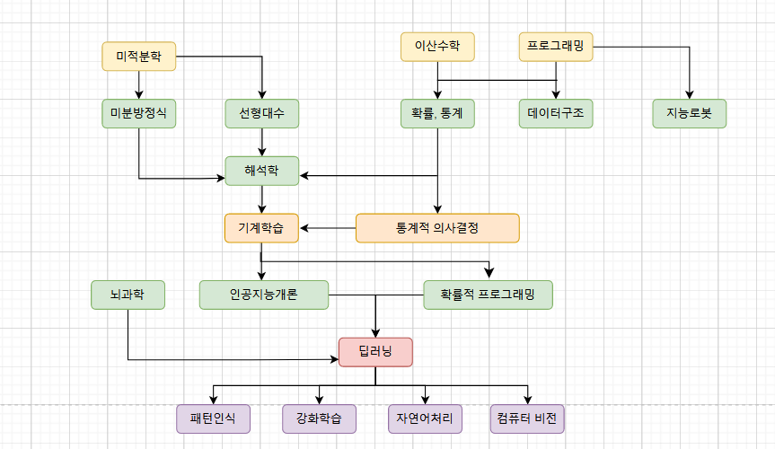
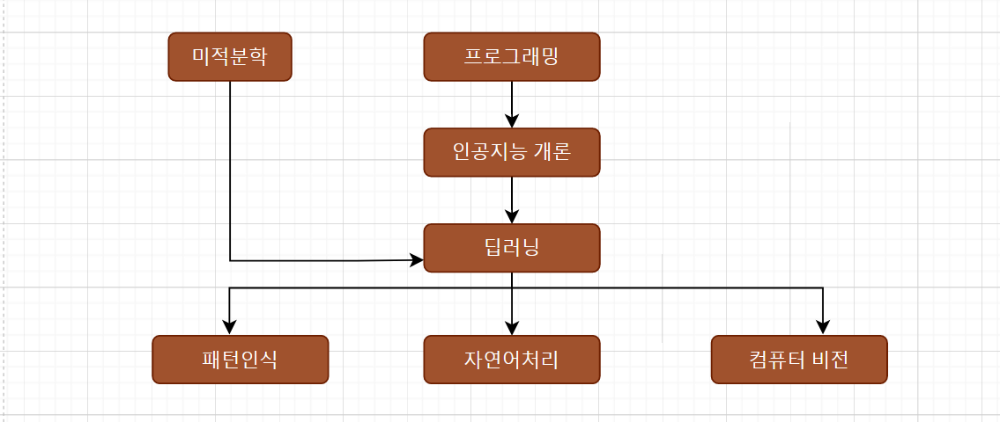

# 01. 비전공자도 인공지능을 배울 수 있나요? 

### 🛠 딥러닝 (Deep Learning) 

##### 인공지능을 만드는 여러가지 기법 중에 하나이며 현재 가장 많이 사용하고 있는 기술이다. 

##### 인간의 뇌 작동원리를 작동하는 것을 흉내내는 것이 딥러닝

# 02. AI, 딥러닝, 그거 배우려면 대학원 가야 되는거 아닌가요?

##### 🛠 딥러닝 공부 테크트리 

##### 이 강의의 커리큘럼 

> 프로그래밍, 뇌과학, 인공지능 개론, 딥러닝, 패턴인식, 자연어처리, 컴퓨터 비전 

##### 🛠 사용할 프레임 워크 : TensorFlow

# 3. 강좌를 들으면 무엇을 할 수 있게 되나요? 

